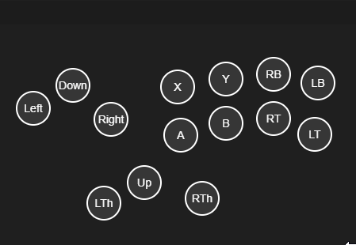

Uses electron and [xinput-ffi](https://github.com/xan105/node-xinput-ffi)

This was entirely vibe coded. Fun quick project to see how chatgpt could cope.
Made to look like a haute 42 pad. Edit index HTML if you'd like to change the button labels. 

```
npm install
npm start
```

right click the dragbar to close i guess



